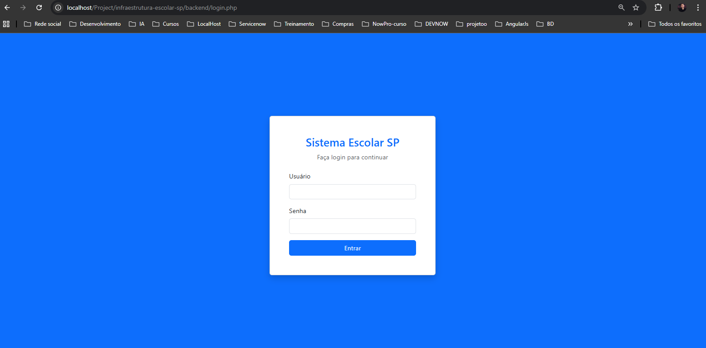
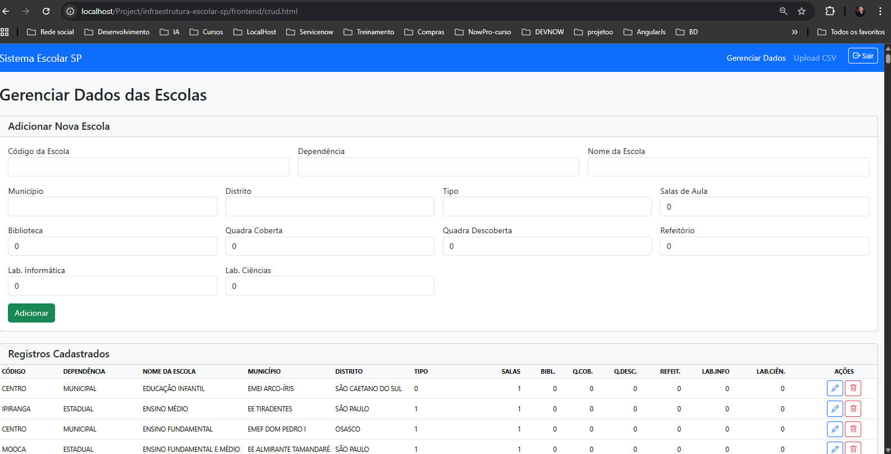
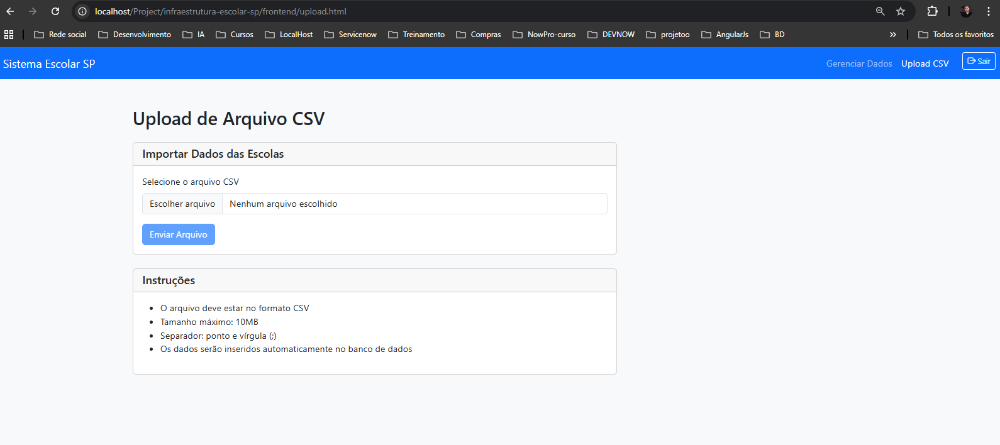

# Sistema de Infraestrutura Escolar - São Paulo

## 📸 Screenshots do Sistema

### Tela de Login


### Gerenciamento de Dados (CRUD)


### Upload de Arquivo CSV


## 💡 Descrição
Aplicação fullstack desenvolvida para gerenciar dados de infraestrutura das escolas do município de São Paulo. O sistema permite importar dados através de arquivos CSV e realizar operações completas de CRUD (Create, Read, Update, Delete) sobre os registros.

## 🚀 Tecnologias Utilizadas

### Backend
- **PHP 8.x**
- **PDO (PHP Data Objects)** 
- **Sessões PHP**

### Frontend
- **Vue.js 3**
- **Bootstrap 5.3**
- **Bootstrap Icons**

### Banco de Dados
- **MySQL**

### Servidor Local
- **XAMPP** - Ambiente de desenvolvimento (Apache + MySQL + PHP)

## 🎯 Funcionalidades Implementadas

### Obrigatórias
- ✅ Upload de arquivo CSV com validação de formato e tamanho
- ✅ Processamento e inserção automática de dados no banco
- ✅ CRUD completo em tela dedicada:
  - **Create**: Adicionar novos registros manualmente
  - **Read**: Visualização em tabela responsiva
  - **Update**: Edição de registros existentes via modal
  - **Delete**: Remoção de registros com confirmação
- ✅ Validação de dados (frontend e backend)
- ✅ Interface responsiva e intuitiva

### Diferenciais
- ✅ Sistema de autenticação com login e senha
- ✅ Proteção de rotas (verificação de sessão)
- ✅ Tela de logout
- ✅ Feedback visual em todas as operações
- ✅ Tratamento de erros de conexão

## ⚙️ Como Executar

### Pré-requisitos
- XAMPP instalado (ou Apache + MySQL + PHP 8.x)
- Navegador web
- Git instalado

### 1. Clone o repositório
```bash
git clone https://github.com/valvesmaia/infraestrutura-escolar-sp
cd infraestrutura-escolar-sp

2. Configure o Banco de Dados
2.1. Inicie o XAMPP

Abra o XAMPP Control Panel
Inicie os serviços Apache e MySQL

2.2. Crie o Banco de Dados
Acesse http://localhost/phpmyadmin e execute:

CREATE DATABASE infraestrutura_escolar CHARACTER SET utf8mb4 COLLATE utf8mb4_general_ci;

/* Tabela para armazenar os dados de infraestrutura escolar */
CREATE TABLE tb_infraestrutura_escolar (
    id INT(11) NOT NULL AUTO_INCREMENT,
    nomedep VARCHAR(100) DEFAULT NULL,
    codesc VARCHAR(20) NOT NULL,
    nomesc VARCHAR(255) NOT NULL,
    mun VARCHAR(100) NOT NULL,
    distr VARCHAR(100) NOT NULL,
    tipoesc_desc VARCHAR(100) DEFAULT NULL,
    salas_aula INT(11) DEFAULT 0,
    biblioteca TINYINT(1) DEFAULT 0,
    quadra_coberta TINYINT(1) DEFAULT 0,
    quadra_descoberta TINYINT(1) DEFAULT 0,
    refeitorio TINYINT(1) DEFAULT 0,
    laboratorio_info TINYINT(1) DEFAULT 0,
    laboratorio_ciencias TINYINT(1) DEFAULT 0,
    PRIMARY KEY (id)
) ENGINE=InnoDB DEFAULT CHARSET=utf8mb4 COLLATE=utf8mb4_general_ci;

/* Tabela para armazenar os dados dos usuários */
CREATE TABLE usuarios (
    id INT(11) NOT NULL AUTO_INCREMENT,
    usuario VARCHAR(50) CHARACTER SET utf8mb4 COLLATE utf8mb4_general_ci NOT NULL,
    senha VARCHAR(255) CHARACTER SET utf8mb4 COLLATE utf8mb4_general_ci NOT NULL,
    criado_em TIMESTAMP NOT NULL DEFAULT CURRENT_TIMESTAMP,
    PRIMARY KEY (id),
    UNIQUE KEY idx_usuario (usuario)
) ENGINE=InnoDB DEFAULT CHARSET=utf8mb4 COLLATE=utf8mb4_general_ci;

INSERT INTO usuarios (usuario, senha) VALUES ('admin@teste.com', MD5('123456'));

3. Configure o Projeto
3.1. Mova o projeto para o diretório do XAMPP

# Windows
C:\xampp\htdocs\Project\infraestrutura-escolar-sp\

3.2. Verifique as configurações do banco

- Edite backend/config/database.php se necessário:

$servidor = 'localhost';
$usuario = 'root';
$senha = '';
$banco = 'infraestrutura_escolar';

4. Acesse o Sistema

- Abra o navegador e acesse:

http://localhost/Project/infraestrutura-escolar-sp/backend/login.php

## 🔐 Credenciais de Acesso
- Usuário de teste:

- Login: admin@teste.com
- Senha: 123456

## 📊 Uso do Sistema
1. Fazer Login

- Acesse a página de login
- Use as credenciais: admin@teste.com / 123456
- Clique em "Entrar"

2. Upload de CSV

- No menu, clique em "Upload CSV"
- Selecione um arquivo CSV válido (máximo 10MB)O arquivo deve usar ponto e vírgula (;) como separador
- Clique em "Enviar Arquivo"
- Aguarde o processamento

3. Gerenciar Dados

- No menu, clique em "Gerenciar Dados"
- Adicionar: Preencha o formulário e clique em "Adicionar"
- Editar: Clique no ícone de lápis na linha desejada
- Excluir: Clique no ícone de lixeira e confirme
- Atualizar: Clique no botão "Atualizar" para recarregar os dados

## 🛠️ Decisões Técnicas

- Seleção de Campos do CSV: O arquivo CSV disponibilizado pela Secretaria de Educação possui um total de 173 colunas. No entanto, para otimizar o tempo de desenvolvimento e manter o foco nas informações mais relevantes sobre a infraestrutura escolar, foram selecionados 13 campos principais. Esses campos representam os dados mais significativos para a análise proposta neste projeto.
- Campos selecionados:

- Identificação: código, nome da escola, dependência
- Localização: município, distrito
- Classificação: tipo de escola
- Infraestrutura: salas de aula, biblioteca, quadras (coberta/descoberta), refeitório, laboratórios (informática/ciências)

- Esta decisão técnica visa manter o sistema simples, funcional e de fácil manutenção, focando na qualidade da implementação dentro do prazo estabelecido.

- Arquitetura

- Separação de responsabilidades: Backend (PHP) e Frontend (Vue.js) independentes
- API REST: Endpoints claros para cada operação CRUD
- Validação em camadas: Frontend (HTML5 + JavaScript) e Backend (PHP)
S- egurança: Prepared statements (PDO) para prevenir SQL Injection


## 🔒 Segurança

- Prepared Statements (PDO): Proteção contra SQL Injection
- Validação de entrada: Campos obrigatórios e limites numéricos
- Sessões PHP: Controle de autenticação
- Verificação de login: Proteção de rotas sensíveis
- Tratamento de erros: Mensagens amigáveis sem exposição de dados sensíveis

## 📝 Validações Implementadas
- Frontend (HTML5 + JavaScript)

- Campos obrigatórios (required)
- Tamanho mínimo/máximo de texto (minlength, maxlength)
- Valores numéricos dentro do intervalo (0-999)
- Formato de arquivo (.csv)
- Tamanho máximo de arquivo (10MB)

- Backend (PHP)

- Verificação de campos vazios
- Validação de tipos de dados
- Sanitização de entradas
- Verificação de extensão de arquivo

## 📄 Fonte dos Dados
- CSV oficial: "Escolas Dependências - 2025" da Secretaria Municipal de Educação de São Paulo

## 📧 Contato
- Para dúvidas sobre o projeto, entre em contato através do repositório GitHub.

## 📄 Licença
- MIT License - Projeto desenvolvido para fins de avaliação técnica